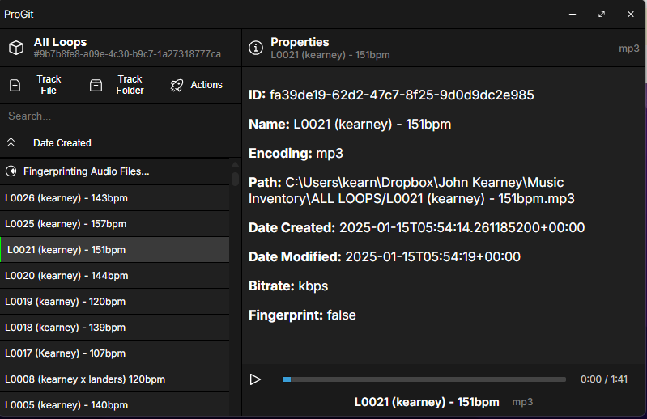

# ProGit

ProGit is a first of its kind version control software built specifically with audio professionals in mind. It is built using Tauri, React and Typescript.

## TODO

### v0.1.0a (Current)
- [x] Implement Basic UI
- [x] Implement Local Database & CRUD Operations
- [x] Implement Git Integration
- [x] Implement audio fingerprinting
- [x] Implement audio player
- [x] Implement Repository Management
- [1/2] Implement File Selection & Management (add removal functionality)
- [ ] Clean up & Refactor CSS 
- [ ] Clean up & Refactor Typescript

### v0.2.0a (Next)
**Backend**
- [ ] Implement audio comparison algorithm (user selected comparison action)
- [ ] Implement audio similarity algorithm (repo-wide comparison action)
- [ ] Implement audio file conversion (user selected conversion action)
- [ ] Implement metadata extraction & changes to audio files on user's system
- [ ] Implement spectrogram generation for audio files
- [ ] Implement support for 

**Frontend**
- [ ] Add metadata editing functionality to `PropertiesPane.tsx` (When exactly one file is selected)

- [ ] Add audio comparison functionality to `PropertiesPane.tsx` (When exactly two files are selected) : This should be a visual representation of the comparison between the two files. Show both spectrograms side by side, and highlight the differences between the two files. 

- [ ] Add audio similarity functionality to `PropertiesPane.tsx` (When > 2 files are selected) : This should be a visual representation of the comparison between the selected files. Show a 2d axis with the selected files plotted on it. The distance between the files should be proportional to the similarity between the files.

## Setup

This project requires:
- Node.js & npm/yarn
- [Rust Toolchain](https://rustup.rs/)
- Tauri CLI (install with `cargo install tauri-cli`)

## Usage
For Desktop Development: 
1. Clone this repository
2. Run `npm i` to install dependencies
3. To start the development server, run: `npm run tauri dev`

For Android Development:
1. Initialize the project with `npm run tauri android init`
2. Run the development server with `npm run tauri android dev`
## Tauri + React + Typescript

This template should help get you started developing with Tauri, React and Typescript in Vite.

## Recommended IDE Setup

- [VS Code](https://code.visualstudio.com/) + [Tauri](https://marketplace.visualstudio.com/items?itemName=tauri-apps.tauri-vscode) + [rust-analyzer](https://marketplace.visualstudio.com/items?itemName=rust-lang.rust-analyzer)

