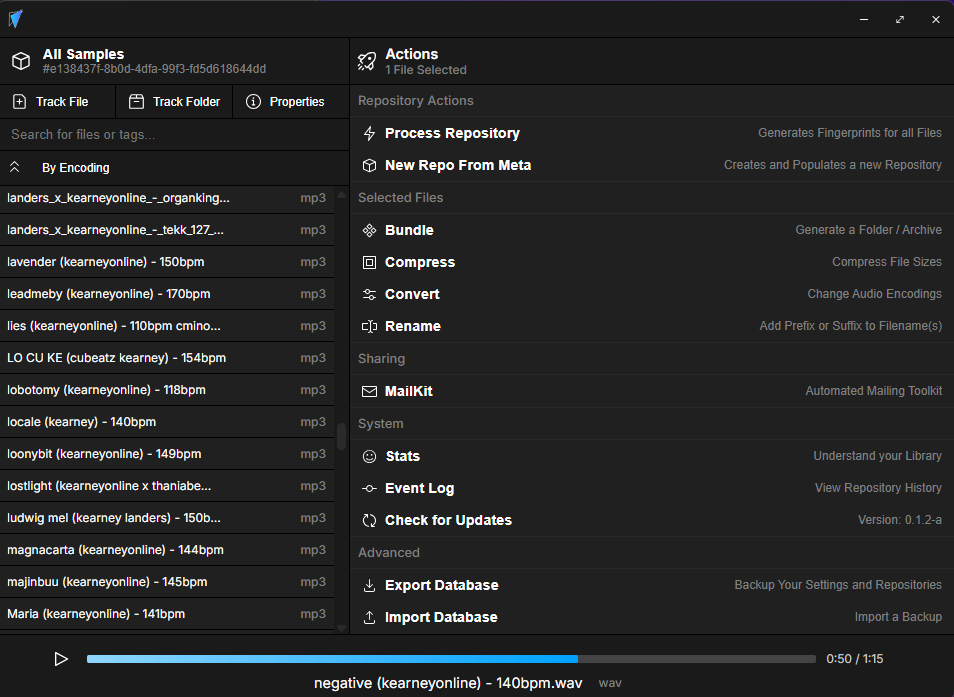

<p align="center">
  
</p>
<h1 align="center">Repo Studio</h1>
<p align="center"><i>A Git-like desktop app for managing and versioning audio files, built for producers and musicians.</i></p>

<!-- <p align="center">
  
</p> -->

</br>

<div align="center">
  <a href="https://github.com/JohnKearney1/repostudio/releases">
    
  </a>
</div>

</br>

<p align="center">
  

  <p align="center">
    
    
    
  </p>
</p>

---

## 🚀 About Repo Studio

Repo Studio is a desktop app for musicians, producers, and audio professionals.  
It brings **Git-style version control** and **audio fingerprinting** for your local music library, helping you manage, compare, and track your sounds with ease.

✨ **Features**  
✅ Repository management  
✅ Audio metadata tagging  
✅ Sonic similarity detection (fingerprinting)  
✅ Git-style tracking and file management  
✅ Audio Playback  


---

## ⚙️ Getting Started

Are you a musician, producer, or audio enthusiast? The section below is mostly for developers.
Visit the [Releases](https://github.com/JohnKearney1/repostudio/releases) page to download the latest version of Repo Studio.

### 🛠️ Built With
- ⚡ **[Tauri Framework](https://tauri.app/)** + Rust Backend
- ⚛️ **[React](https://reactjs.org/)** + Typescript
- 🎧 [Symphonia](https://github.com/pdeljanov/Symphonia) (audio decoding)  
- 🧬 [Rusty Chromaprint](https://github.com/acoustid/rusty-chromaprint) (audio fingerprinting)  
- 🏷️ [Lofty](https://github.com/Serial-ATA/lofty-rs) (audio metadata)

---

### Prerequisites
- 📦 [Node.js](https://nodejs.org/) (v18+ recommended)
- 🦀 [Rust Toolchain](https://rustup.rs/) (Stable)
- 🔧 [Tauri CLI](https://tauri.app/v1/guides/getting-started/prerequisites/)  

---

### 🔨 Development Setup
```bash
# 1. Clone the repo
git clone https://github.com/yourusername/repo-studio.git
cd repo-studio

# 2. Install frontend dependencies
npm install

# 3. Start the dev server
npm run tauri dev
```

### 🏗️ Build for Production
```bash
npm run tauri build
```

---

## 💡 Recommended IDE Setup
- 📝 [VS Code](https://code.visualstudio.com/)
- 📦 Extensions:  
  - [Tauri Extension](https://marketplace.visualstudio.com/items?itemName=tauri-apps.tauri-vscode)  
  - [rust-analyzer](https://marketplace.visualstudio.com/items?itemName=rust-lang.rust-analyzer)

---

## ✅ Current Roadmap (v0.1.x-a)
- [x] Basic UI & UX
- [x] Local Database CRUD
- [x] Git-like Repo Management
- [x] Audio Fingerprinting
- [x] Audio Player
- [x] File System Metadata Sync
- [x] True Folder Tracking  
- [x] Real-time Folder Monitoring
- [x] File Selection & Management
- [x] Actions Page
- [x] Settings Page


---